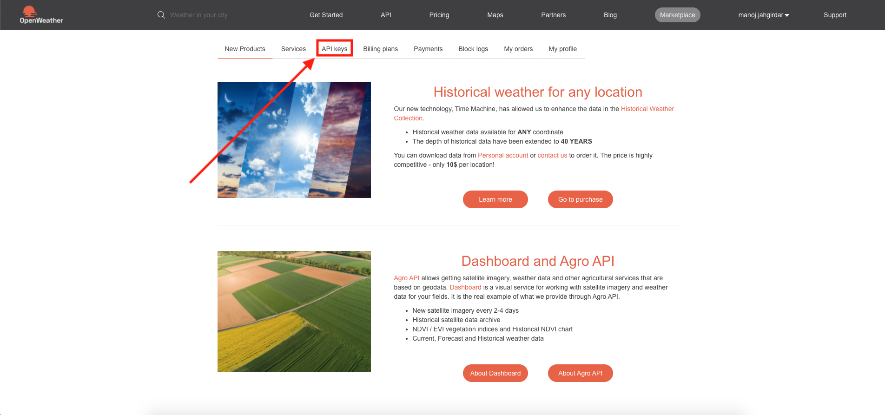
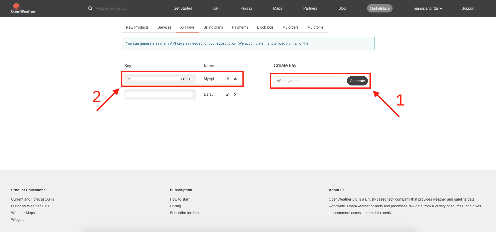

# *** Work in Progress ***

# build-deploy-manage-cloud-native-application-on-openshift
This code pattern will showcase a complete lifecycle (Develop, Deploy and Manage) of a Cloud Native Java application. This will show how to develop an application using Codewind, deploy the application to RedHat Openshift using tekton and manage (Access Control and Scaling) the application.

## Steps

1. [Get the API key from Open Weather](#1-get-the-api-key-from-open-weather)
2. [Add the API key in the Application]()
3. [Run the Application]()

### 1. Get the API key from Open Weather

- Goto [Open Weather](https://home.openweathermap.org/users/sign_up) and sign up/sign in.

- Once you have created an account in Open Weather, Login and click on `API keys` as shown.

- Create an `API Key`, 
  - 1. Enter a name and click on `generate`. 
  - 2. You will see your API Key as shown. Copy it as it will be required in the next step.

### 2. Add the API key in the Application

- In the [server.js](https://github.com/IBM/build-deploy-manage-cloud-native-application-on-openshift/blob/master/server/server.js), on line number 22, paste the `api key` created in [step 1](#1-get-the-api-key-from-open-weather)

### 3. Run the Application

To build and run the application:
1. `npm install`
2. `npm start`

To run the application in Docker use the Docker file called `Dockerfile`.

### Endpoints

The application will run on localhost port [`3000`](http://localhost:3000)

The application exposes the following endpoints:
* Health endpoint: `<host>:<port>/health`.

### Screenshots

