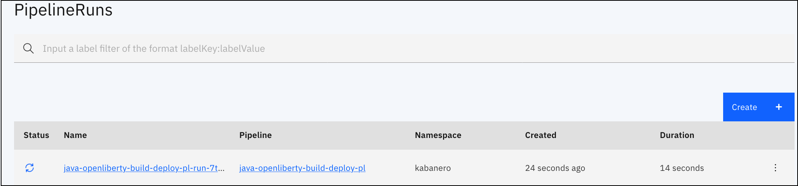
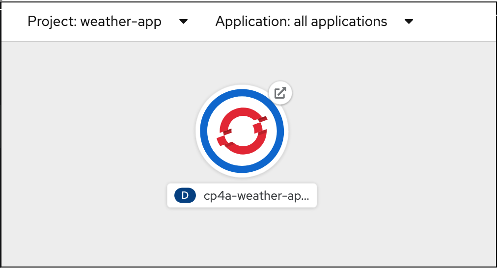

## Build and Deploy Cloud-Native Java application using IBM Cloud Pak for Applications

### Develop a weather application using Codewind and deploy using CI/CD Tekton pipelines


IBM Cloud Pak for Applications (CP4A) helps you modernize existing applications and develop new cloud-native applications that can quickly deliver value and can be tailored to your specific needs. This can help you to respond to customer needs faster.

In this code pattern, you will use the Accelerators for Teams feature of CP4A to demonstrate how to develop a cloud-native application and deploy it on OpenShift using CI/CD features. 

**Accelerator for Teams of CP4A - overview**

Enterprises are moving towards cloud-native development for a host of benefits. However, to realize the benefits of cloud-native development and to deliver faster, enterprises must overcome the challenges of retaining enterprise governance, and the cost of building new skills and transforming end-to-end development practices.

The Accelerator for Teams for cloud-native solutions are designed to speed up the development of cloud-native applications by providing an end-to-end journey from a business problem to a production application. It provides enterprise governance by bringing together Application Stacks, integrated DevOps and a choice of developer tools. Cloud native services is even faster because the Accelerators for Teams automatically generates the development projects, services, and configuration settings that can deploy your application to an OpenShift cluster. All your development teams need to do is code your business logic.

Developer experience for IDEs is provided by Codewind, which is used for creating, building, running, and profiling applications. Tekton pipelines provide consistent, managed, and governed CI/CD processes that react to repository events that occur during code development. 

You will develop a simple Java weather application using Codewind and Tekton pipeline for Continuous delivery in this code pattern. 

Accelerators deliver innovative technology to speed up the design process. As well as embedding Reference Blueprints that are based on Reference Architectures in the  [Cloud Architecture Center](https://www.ibm.com/cloud/architecture/architectures), they also provide the framework for designing your application from scratch.

After completing this code pattern, you will understand how to:
* build a simple Java application using Codewind on Eclipse
* use Tekton pipelines to deploy the Java application on OpenShift using CP4A 

At the end, you will run the application with a simple interface which accepts name or latitude/longitude of the location and provides basic weather details of the location using Open Weather API.

## Flow


1. User installs Codewind and add stack hub provided by IBM Cloud Pak for Applications on IBM Managed OpenShift cluster.
2. User develops an application using a project template available in the added stack hub.
3. User pushes the developed application code to the GitHub repository.
4. User configures Tekton Pipeline and defines GitHub Webhook on IBM Cloud Pak for Applications.
5. Tekton pipeline builds and deploys the application to OpenShift cluster whenever there is code change event in GitHub repository.
6. User accesses the deployed application.


## Pre-requisites

* Eclipse editor: You can install the latest version from [here](https://www.eclipse.org/downloads/packages/).
* Docker: Install [Docker](https://docs.docker.com/install/) 17.06 or later. If you use Linux, you must also install [Docker Compose](https://docs.docker.com/compose/install/).
* Cloud Pak for Applications instance: Refer this [link](https://cloud.ibm.com/catalog/content/ibm-cp-applications-b4fbe4b9-a9de-406a-94de-5e0c7dc20bf7-global) for details.
* OpenShift command-line interface (CLI). Refer these [instructions](https://docs.openshift.com/container-platform/4.3/cli_reference/openshift_cli/getting-started-cli.html#installing-the-cli) to install OC CLI on your local machine.

## Steps

1. [Install Codewind and Appsody](#1-install-codewind-and-appsody)
2. [Add project templates to Codewind](#2-add-project-templates-to-codewind)
3. [Create a project in Codewind](#3-create-a-project-in-codewind)
4. [Get API Key from Open Weather](#4-get-api-key-from-open-weather)
5. [Run the application locally](#5-run-the-application-locally)
6. [Prepare application to be deployed to CP4A](#6-prepare-application-to-be-deployed-to-cp4a)
7. [Push application code to GitHub repository](#7-push-application-code-to-github-repository)
8. [Create token for your Github](#8-create-token-for-your-github)
9. [Configure and Execute Tekton Pipeline](#9-configure-and-execute-tekton-pipeline)
10. [Access the deployed Application](#10-access-the-deployed-application)

### 1. Install Codewind and Appsody


- Appsody. Refer this [installation instructions](https://appsody.dev/docs/installing/installing-appsody/).

- Install Codewind on eclipse. You may use these [instructions](https://www.eclipse.org/codewind/eclipse-getting-started.html#installing-codewind-for-eclipse).

### 2. Add project templates to Codewind

IBM Cloud Pak for Applications provide a set of project templates. We will configure Codewind to use this template to create projects so that we have all the necessary resources readily available to deploy application to CP4A.
- Access OpenShift Cluster Web Console on IBM Cloud.

  

- On OpenShift Web Console, click the grid icon on the top and click `Cloud Pak Console`.

  

- On Cloud Pak Console, click on `View team instance` button (Scroll a bit down on the home page)

  

- Copy the `Codewind URL`. 

  

The Codewind project templates needs to be added to Codewind in Eclipse IDE. 

- Go to Eclipse IDE > Codewind explorer view `(Menu > Window > Show View > Other.. and search for Codewind)`

- In Codewind Explorer view, ensure that the `Local` connection in Codewind view is in running status. 

  

- Right click on the `Local` connection and click `Manage Template Sources...`

  

  

- It opens `Manage Template Sources` window. Click on `Add...` button. 

  

- In the popup window enter URL - Codewind URL copied earlier. Provide a Name. Optionally add a description. Click `OK`.

  

- The template gets added to Template Sources. Click the refresh button if the newly added template is not reflecting in the list.

### 3. Create a project in Codewind

You can create a project in Codewind either by pointing to an existing Codewind project provided in this repository or by creating a new project from scratch. In this demonstration we will use an existing Codewind project. 

- Open terminal application. Change to a directory where you want to clone the existing project. Run the below command to clone the project.

  ```
  $ git clone https://github.com/IBM/build-deploy-cloud-native-application-using-cp4a.git
  ```

- In eclipse Codewind Explorer view, right click on `Local` connection. Click on `Add Existing Project...`

  

- In the popup window, browse the parent directory of the cloned repository. Click `Next`.

  

- Once imported, the next screen shows that it is a project of Type `appsodyExtension` and is a Java project.

- Click `Finish`. A new Codewind project is created from the cloned repository. The application will be built and deployed on local docker container to run. The status should change to `Running` after a while.

> If you wish to create a new project, `Create New Project` using Codewind Explorer and select a project template as `Kabanero Open Liberty template` from Kabanero Stack that were referenced in step 2 above. 


<!--#### 3.2 Create a new Project

<!-- - Right click on `Local` connection in Codewind explorer view. And click `Create New Project...`.

  <!--

<!-- - In `New Codewind Project` popup window enter `Project name` and select a Kabanero stack template. Click `Finish`.

  <!--

<!-- - The project gets created in eclipse workspace. Additionally, the application is built and deployed to local docker container. The status of the application will change to `Running` after a while.


<!-- - Once the template is initialized successfully, you can edit the project code to include your custom code. The changes are immediately built and deployed.
-->

### 4. Get API Key from Open Weather

Since the application provided in this repository accesses weather information from [Open Weather](https://home.openweathermap.org), we will have to get API Key from Open Weather.

- Register at [Open Weather](https://home.openweathermap.org/users/sign_up), if not already registered.

- Login at https://home.openweathermap.org and click on `API keys` as shown.

  

- Enter a name for API Key and click `Generate`.

  

- Copy the API key generated. This key needs to be added in code.

- Go to eclipse IDE and navigate to `WeatherResources.java` file. Double click on the file to open it.
  

- Around line no. 35, paste the API key that you copied within the double quotes for the constant String `API_KEY`. Save the file. The changes get deployed.

  

### 5. Run the application locally

- Now the project is deployed and running on local docker container. To access the application, right-click on the application entry in Codewind Explorer view, and click on `Open Application`. 

  

- The application home page is launched in a browser.

  

- Enter either city name or Latitude/Longitude of a location and click on `Submit`. The location's weather details are displayed.

  

- You can perform various operations on the application, including checking log files, debugging, monitor performance. 

  

- You can get more details about these project actions [here](https://www.eclipse.org/codewind/project-actions.html).

### 6. Prepare application to be deployed to CP4A

The deployment manifest for your project is created when you run `appsody build`. The Appsody CLI uses deployment information from the stack and adds various [traceability metadata](https://appsody.dev/docs/reference/metadata) while generating this manifest. You can edit this file to suit your application and store it under source control. Your deployment configuration is taken care of so that you can focus on your application development. Let's create the deployment manifest file which will be used for application deployment.

- On command prompt, change directory to project parent folder.
- Run the following command
  ```
  $ appsody build
  ```
- This command will take a few minutes. When the command runs successfully, it will generate `app-deploy.yaml` files in the project parent folder.
- Decide the namespace where you want to deploy the application. You can use any of the existing namespaces or create new. It is recommended that you use separate namespaces for individual applications/projects. Here, we create a new namespace in OpenShift Cluster using the below commands.
    - Login to OpenShift Cluster. Navigate to `IBM Cloud Dashboard > Clusters > Your OpenShift Cluster > OpenShift web console`. On web console, click the menu in the upper right corner (the label contains your email address), and select Copy Login Command. Click on `Display token`, copy the login command and paste the command into your local console window.
      ```
      oc login --token=xxxx --server=https://xxxx.containers.cloud.ibm.com:xxx
      ```
    - Create new project.
      ```
      oc new-project weather-app  ## where weather-app is the namespace name which can be any name
      ```
- Open `app-deploy.yaml` file and add a namespace section as shown below. Here the namespace name will be the name where you want to deploy your application.

  ```
  apiVersion: appsody.dev/v1beta1
  kind: AppsodyApplication
  metadata:
    namespace: weather-app
    annotations:
      architecture: x86_64
      authoritative-source-url: registry.access.redhat.com
      ....
  ```
- Save the file.

### 7. Push application code to GitHub repository 

Once you have added your code into the application and have tested the same, now it is time to deploy the code to the OpenShift Cluster using IBM Cloud Pak for Application. In this code pattern, Tekton pipelines from CP4A is used to deploy the application. To make the application code accessible for pipeline, need to push our application code to GitHub repository.

- Create a new repository in [GitHub](https://github.com). 

- Delete `.git` directory inside the cloned repository parent folder before pushing it to your GitHub. 

  ```
    cd build-deploy-cloud-native-application-using-cp4a
    rm -rf .git
  ```

- Run below commands

  ```
  $ git init
  $ git add -A
  $ git commit -m "<your comments>"
  $ git remote add origin <newly-created-git-repo-url-in-your-account>
  $ git push -u origin master
  ```

Application code is now pushed to your GitHub repository.

### 8. Create token for your Github

Before configuring the Tekton Pipeline, you need to create GitHub token so that the pipeline could access your application code. Follow the below steps to create the Github token.

* Open [GitHub](https://github.com) and log into your account.
* Click your profile photo to expand the account profile menu.
* From the menu, click 
  ` Settings > Developer settings > Personal access tokens`
* Click the Generate new token button. Provide your Github password again when prompted.

  
  
* Give a descriptive name into the Note field.
* Select the scopes, or permissions, you’d like to grant this token. To use your token to access repositories from the tekton pipeline, select the `repo` checkbox. Click the `Generate token` button.
* Copy the token to your clipboard and make a note of this token safely. For security reasons, after you navigate off the page, you will not be able to see the token again.

### 9. Configure and Execute Tekton Pipeline

Launch your `Openshift cluster Console` and then click on `Cloud Pak Console`.

In Cloud Pak Console, navigate to `Instances` and then `Manage Pipelines` as shown in snapshot below.


In the newly opened tab, click on `Log-in with OpenShift` then it will launch a tekton dashboard as shown.


**Tekton Dashboard** shows tekton resources, namespace, secrets, service accounts, webhooks etc. The IBM Cloud Pak for Application provides some pre-defined pipelines for Java and NodeJs application in Kabanero namespace. If the default provided pipelines does not fulfil the purpose then you can write your own pipeline code and use `Import Tekton Resource` option. Here in this code pattern, you will use the pre-defined pipeline for the weather app (Java application). The first step towards configuring the pipeline is that you need to create the webhook. Let's start.

**Create Webhook**

* Select `Webhooks` from the left-side menu of the tekton dashboard.

* Click `Add Webhook`. The Create Webhook pane opens.

* Under `Webhook Settings` enter the following information:
    * **Name** is your webhook name. Choose a unique webhook name.
    * **Repositry URL** is your github repository URL where the application code resides
    * **Access Token** is the token to access your github repository that you created in the previous step. Click the add (+) button and enter a name for this secret and the GitHub Access Token into the fields provided.
    
* Under `Target Pipeline Settings` provide the following information:
    * select **Namespace** as `kabanero`.
    * select **Pipeline** as per your application requirement. Here in this code pattern, a weather app is developed in Java and will be deployed using OpenLiberty hence select `java-openliberty-build-deploy-pl`.
    * select **Service Account** as `kabanero-operator`.
    * **Docker Registry** is the url where the container image will be pushed. You can add your own Docker Hub registry, IBM Container Registry or integrated OpenShift Container Platform Registry. For OpenShift cluster 4.x, integrated OpenShift container registry URL is `image-registry.openshift-image-registry.svc:5000/<namespace-name>`, where namespace name is the project name where you want to deploy your application. It should be the same namespace which you have added in `app-deploy.yaml` in step 6 above.
    

    

* Click `Create`.

**Validate Webhook**

* Validate that Tekton and GitHub are successfully connected by opening your Github repository. Go to `Your Github repository > Settings -> Webhooks`. It should show a link as shown.

  

**Trigger Tekton Pipeline**

* Make some changes in your Github code repository or merge a pull request in the GitHub code repository. It will trigger the pipeline.

* Check your Tekton dashboard. Under the Tekton resources list, select `PipelineRuns`. It should show the pipelinerun in running state. 

  

* Wait for this one to get completed. You can check logs of this pipeline using tekton dashboard. Click on the name of your pipelinerun, it will show you the tasks being executed for your pipeline, logs and its status.

  
  
  You can also check the status of pipelinerun using `oc describe pipelinerun <pipelinerun-name>` commands. If pipelinerun fails because of any issue then better to check pods and a specific container logs for more details. You can also use Tekton CLI `tkn` for the same purpose.

When the pipeline run completes, verify that the application is running using the following commands. Here `namespace-name` is the one which you have used in step 6 and step 9 above.

```
  $ oc get pods -n <namespace-name>
  $ oc get svc -n <namespace-name>
```

It should show the pod and service corresponding to the application.

### 10. Access the deployed Application

To access the deployed application, get the URL of the application using following command:

```
  $ oc get routes -n <namespace-name>
  
  ##output will be something like this
  cp4a-XXX-openliberty   cp4a-weather-app-openliberty.XXXXXX.us-south.containers.appdomain.cloud          cp4a-XXX-openliberty   9080-tcp                 None
```

It will be visible on the OpenShift Console too as shown:



Access the URL and perform various operations as explained in [step 5](#5-run-the-application-locally) above.

## Learn More

- [IBM Cloud Pak for Application](https://developer.ibm.com/series/introduction-ibm-cloud-paks-for-applications/)
- [Introduction to accelerators for cloud-native solutions](https://developer.ibm.com/articles/introduction-to-accelerators-for-cloud-native-solutions/)
- [Developer’s guide to IBM Cloud Pak for Applications](https://developer.ibm.com/series/developers-guide-to-ibm-cloud-pak-for-applications/)


## License

This code pattern is licensed under the Apache Software License, Version 2. Separate third-party code objects invoked within this code pattern are licensed by their respective providers pursuant to their own separate licenses. Contributions are subject to the [Developer Certificate of Origin, Version 1.1 (DCO)](https://developercertificate.org/) and the [Apache Software License, Version 2](https://www.apache.org/licenses/LICENSE-2.0.txt).

[Apache Software License (ASL) FAQ](https://www.apache.org/foundation/license-faq.html#WhatDoesItMEAN)
