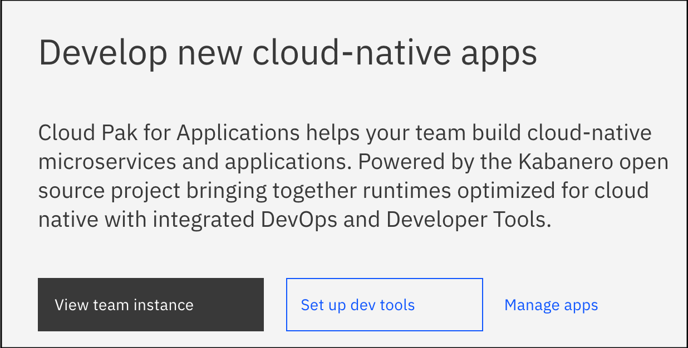
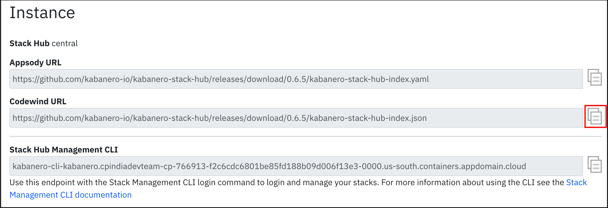
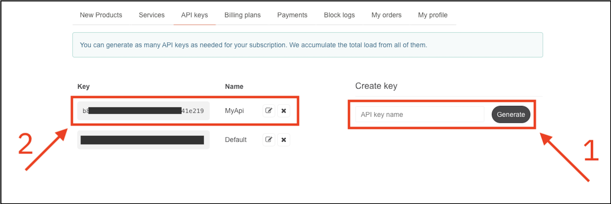

## Work-in-progress

## Build and Deploy Cloud-Native application using Accelerator for Teams in IBM Cloud Pak for Applications

### Develop a weather application using Codewind and deploy using CI/CD Tekton pipelines


IBM Cloud Pak for Applications(CP4A) helps you modernize existing applications, embed additional security, and develop new apps that unleash digital initiatives. It offers cloud-native development solutions that can quickly deliver value, along with flexible licensing that can be tailored to your specific needs. Apps that are built in the cloud are typically more scalable, easier to update and less costly to run. This can help you to respond to customer needs faster.

In this code pattern, we use Accelerators for Teams of CP4A to demonstrate how to develop a cloud-native application and deploy it on CP4A using CI/CD features. We develop a simple Java weather application. We use Codewind to develop, Appsody to build and Tekton for Continous delivery. 


**IBM Accelerator for Teams - overview**

Accelerator for Teams is the enterprise-ready and fully supported implementation of the Kabanero open source community project. Accelerator for Teams integrates with, extends, and adds value to Red Hat OpenShift. Accelerator for Teams supports the activity of application developers, architects, and operations teams in developing, managing, and deploying cloud native applications that meet the requirements of an organization. The product enables Continuous Integration / Continuous Deployment (CI/CD) workflows across the end to end development lifecycle.


Kabanero installs on OpenShift and integrates a modern DevOps toolchain and application stack hubs which enable developers to use runtimes and frameworks in pre-built container images called `Application stacks`.

Kabanero's developer experience for IDEs is provided by Eclipse Codewind. For more information on how Kabanero and its components work, visit [Kabanero's Architecture and Development Workflows](https://kabanero.io/docs/ref/general/overview/architecture-overview.html).

Eclipse Codewind provides the ability to create application projects from these `Application Stacks` that your company has built, enabling developers to focus on their code and not infrastructure and Kubernetes.  These include IBM Cloud starters, OpenShift Do (odo), and Appsody templates. Today, there are templates for: IBM Cloud Starters, odo, Eclipse MicroProfile/Java EE, Springboot, Node.js, Node.js with Express, Node.js with Loopback. Application deployments to Kubernetes occur via pipelines when developers commit their local code to the correct Git repos Kabanero is managing via webhooks.


After completeing this code pattern, you will understand how to:
* build a simple Java application using Codewind on Eclipse
* use Tekton pipelines to deploy the Java application on OpenShift using CP4A 

At the end, you will run the application with a simple interface which accepts name or latitude/longitude of the location and provides basic weather details of the location using Open Weather API.

## Flow


1. User develops/updates an application in Codewind.
2. User pushes the code to GitHub repository.
3. Tekton gets the information about the changes through GitHub Webhooks.
4. Tekton pipelines deploy the application.
5. User accesses the application.


## Pre-requisites

* Eclipse editor: You can install the latest version from [here](https://www.eclipse.org/downloads/packages/).

* Docker: Install [Docker](https://docs.docker.com/install/) 17.06 or later. If you use Linux, you must also install [Docker Compose](https://docs.docker.com/compose/install/).

* Cloud Pak for Applications instance: Refer this [link](https://cloud.ibm.com/catalog/content/ibm-cp-applications-b4fbe4b9-a9de-406a-94de-5e0c7dc20bf7-global) for details.

## Steps

1. [Install Codewind and Appsody](#1-install-codewind-and-appsody)
2. [Add project templates to Codewind](#2-add-project-templates-to-codewind)
3. [Create a project in Codewind](#3-create-a-project-in-codewind)
4. [Get API Key from Open Weather](#4-get-api-key-from-open-weather)
5. [Run the application locally](#5-run-the-application-locally)
6. [Push application code to GitHub repository](#6-push-application-code-to-github-repository)
7. [Create token for your Github](#7-create-token-for-your-github)
8. [Configure and Execute Tekton Pipeline](#8-configure-and-execute-tekton-pipeline)
9. [Access the deployed Application](#9-access-the-deployed-application)

### 1. Install Codewind and Appsody


- Appsody. Refer this [installation instructions](https://appsody.dev/docs/installing/installing-appsody/).

- Install Codewind on eclipse. You may use these [instructions](https://www.eclipse.org/codewind/eclipse-getting-started.html#installing-codewind-for-eclipse).

### 2. Add project templates to Codewind

IBM Cloud Pak for Applications provide a set of project templates. We will configure Codewind to use this template to create projects so that we have all the necessary resources readily available to deploy application to CP4A.
- Login to your CP4A instance.

- On the home page (scroll a bit down). Click on `View team instance` button. 

  

- Copy the `Codewind URL`. 

  

We will use this endpoint with the Stack Management CLI login command to login and manage your stacks. For more information about using the CLI see the [Stack Management CLI documentation](https://ibm-cp-applications.cpindiadevteam-cp-766913-f2c6cdc6801be85fd188b09d006f13e3-0000.us-south.containers.appdomain.cloud/docs/ref/general/reference/kabanero-cli.html).

- Ensure that the `Local` connection in Codewind view is in running status. 

- Right click on the `Local` connection and click `Manage Template Sources...`


- It opens `Manage Template Sources` window. Click on `Add...` button. 

  

- In the popup window enter URL - Codewind URL copied earlier. Provide a Name. Optionally add a description. Click `OK`.

  

- The template gets added to Template Sources. Click the refresh button if the newly added template is not reflecting in the list.

### 3. Create a project in Codewind

You can create a project in codewind either by pointing to an existing Codewind project or by creating a new project from scratch. In this demonstration we will use an existing application. However, you can follow any method and create your own application. Let's see both the ways of doing it.


#### 3.1 Add an existing project

- For the sake of this code pattern, we have a readily available [Codewind project](https://github.com/IBM/build-deploy-manage-cloud-native-application-on-openshift). 

- Open terminal application. Change to a directory where you want to clone the existing project. Run the below command to clone the project.

  ```
  $ git clone git@github.com:IBM/build-deploy-manage-cloud-native-application-on-openshift.git
  ```

- In eclipse Codewind Explorer view, right click on `Local` connection. Click on `Add Existing Project...`

  

- In the popup window, browse the parent directory of the cloned repository. Click `Next`.

  

- Click `Finish`. A new Codewind project is created from the cloned repository. The application will be built and deployed on local docker container to run. The status will change to `Running` after a while.

#### 3.2 Create a new Project

- Right click on `Local` connection in Codewind explorer view. And click `Create New Project...`.

  

- In `New Codewind Project` popup window enter `Project name` and select a Kabanero stack template. Click `Finsih`.

  

- The project gets created in eclipse workspace. Additionally, the application is built and deployed to local docker container. The status of the application will change to `Running` after a while.


- Once the template is initialized successfully, you can edit the project code to include your custom code. The changes are immediately built and deployed.

### 4. Get API Key from Open Weather

Since the application we are using accesses weather information from [Open Weather](https://home.openweathermap.org), we will have to get API Key from Open Weather.

- Register at [Open Weather](https://home.openweathermap.org/users/sign_up), if not already registered.

- Login at https://home.openweathermap.org and click on `API keys` as shown.

  

- Enter a name for API Key and click `Generate`.

  

- Copy the api key generated. This key needs to be added in code.

- Go to eclipse IDE and navigate to `WeatherResources.java` file. Double click on the file to open it.


- Around line no. 35, paste the API key that you copied within the double quotes for the variable `apikey`. Save the file. The changes get deployed.

### 5. Run the application locally

- Now the project is deployed and running on local docker container. To access the application, right-click on the application entry in Codewind Explorer view, and click on `Open Application`. 


- The application home page is launched in a browser.

  

- Enter either city name or Latitude/Longitude of a location and click on `Submit`. The location's weather details are displayed.

  


- You can perform various operations on the application, including checking log files, debugging, monitor performance. 

  

- You can get more details about these project actions [here](https://www.eclipse.org/codewind/project-actions.html).

  

### 6. Prepare application to be deployed to CP4A

The deployment manifest for your project is created when you run `appsody build`. The Appsody CLI uses deployment information from the stack and adds various [traceability metadata](https://appsody.dev/docs/reference/metadata) while generating this manifest. You can edit this file to suit your application and store it under source control. Your deployment configuration is taken care of so that you can focus on your application development. Let's create the deployment manifest file which will be used for application deployment.

- On command prompt, change directory to project parent folder.
- Run the following command
  ```
  $ appsody build
  ```
- When the command runs successfully, it will generate `app-deploy.yaml` files in the project parent folder.
- Open `app-delpoy.yaml` file and add a namespace section as shown below. Here the namespace name will be the name where you want to deploy your application. In this code pattern, the app will be deployed in `weather-app` namespace which was created using `oc new-project` in the OpenShift cluster. You can use `kabanero` namespace as well.
  > Note: It is recommended that you use separate namespaces either for individual applications/projects.

  ```
  apiVersion: appsody.dev/v1beta1
  kind: AppsodyApplication
  metadata:
    namespace: weather-app
    annotations:
      architecture: x86_64
      authoritative-source-url: registry.access.redhat.com
      ....
  ```
- Save the file.

### 7. Push application code to GitHub repository 

Once you have added your code into the application and have tested the same, now it is time to deploy the code to the OpenShift Cluster using IBM Cloud Pak for Application. In this code pattern, Tekton pipelines from CP4A is used to deploy the application. To make the application code accessible for pipeline, need to push our application code to GitHub repository.

- Create a new repository in [GitHub](https://github.com). 

- ***If you have cloned this repository***

  If you have already cloned the repo and using it for this code pattern, then you need to delete `.git` directory before pushing it to your GitHub. Then follow the steps given next.
  
  ***If you have created a new project***
  
  In case you have created a new project in Codewind, then use the below commands to push the code to GitHub repository.

- Navigate to parent folder of the project on your local machine.

- Run below commands

  ```
  $ git init
  $ git add -A
  $ git commit -m "<your comments>"
  $ git remote add origin <git url>
  $ git push -u origin master
  ```
  

Application code is now pushed to GitHub repository.

### 7. Create token for your Github

Before configuring the Tekton Pipeline, you need to create GitHub token so that the pipeline could access your application code. Follow the below steps to create the Github token.

* Open [GitHub](https://github.com) and log into your account.
* Click your profile photo to expand the account profile menu.
* From the menu, click 
  ` Settings > Developer settings > Personal access tokens`
* Click the Generate new token button. Provide your Github password again when prompted.

  
  
* Give a descriptive name into the Note field.
* Select the scopes, or permissions, you’d like to grant this token. To use your token to access repositories from the tekton pipeline, select the `repo` checkbox. Click the `Generate token` button.
* Copy the token to your clipboard and make a note of this token safely. For security reasons, after you navigate off the page, you will not be able to see the token again.

### 8. Configure and Execute Tekton Pipeline

Launch your `Openshift cluster Console` and then click on `Cloud Pak Console`.

In Cloud Pak Console, navigate to `Instances` and then `Manage Pipelines` as shown in snapshot below.


In the newly opened tab, click on `Log-in with OpenShift` then it will launch a tekton dashboard as shown.


**Tekton Dashboard** shows tekton resources, namespace, secrets, service accounts, webhooks etc. The IBM Cloud Pak for Application provides some pre-defined pipelines for Java and NodeJs application in Kabanero namespace. If the default provided pipelines does not fulfil the purpose then you can write your own pipeline code and use `Import Tekton Resource` option. Here in this code pattern, you will use the pre-defined pipeline for the weather app (Java application). The first step towards configuring the pipeline is that you need to create the webhook. Let's start.

**Create Webhook**

* Select `Webhooks` from the left-side menu of the tekton dashboard.

* Click `Add Webhook`. The Create Webhook pane opens.

* Under `Webhook Settings` enter the following information:
    * **Name** is your webhook name. Choose a unique webhook name.
    * **Repositry URL** is your github repository URL where the application code resides
    * **Access Token** is the token to access your github repository that you created in the previous step. Click the add (+) button and enter a name for this secret and the GitHub Access Token into the fields provided.
    
* Under `Target Pipeline Settings` provide the following information:
    * select **Namespace** as `kabanero`.
    * select **Pipeline** as per your application requirement. Here in this code pattern, a weather app is developed in Java and will be deployed using OpenLiberty hence select `java-openliberty-build-deploy-pl`.
    * select **Service Account** as `kabanero-operator`.
    * **Docker Registry** is the url where the container image will be pushed. You can add your own Docker Hub registry, IBM Container Registry or integrated OpenShift Container Platform Registry. For OpenShift cluster 4.x, integrated OpenShift container registry URL is `image-registry.openshift-image-registry.svc:5000/<namespace-name>`, where namespace name is the project name where you want to deploy your application. It should be the same namespace which you have added in `app-deploy.yaml` in step 6 above.
    


* Click `Create`.

**Validate Webhook**

* Validate that Tekton and GitHub are successfully connected by opening your Github repository. Go to `Your Github repository > Settings -> Webhooks`. It should show a link as shown.


**Trigger Tekton Pipeline**

* Make some changes in your Github code repository or merge a pull request in the GitHub code repository. It will trigger the pipeline.

* Check your Tekton dashboard. Under the Tekton resources list, select `PipelineRuns`. It should show the pipelinerun in running state. 

  

* Wait for this one to get completed. You can check logs of this pipeline using tekton dashboard. Click on the name of your pipelinerun, it will show you the tasks being executed for your pipeline, logs and its status.

  
  
  You can also check the status of pipelinerun using `oc describe pipelinerun <pipelinerun-name>` commands. If pipelinerun fails because of any issue then better to check pods and a specific container logs for more details. You can also use Tekton CLI `tkn` for the same purpose.

When the pipeline run completes, verify that the application is running using the following commands.

```
  $ oc get pods -n <namespace-name>
  $ oc get svc -n <namespace-name>
```

It should show the pod and service corresponding to the application.

### 9. Access the deployed Application

To access the deployed application, get the URL of the application using following command:

```
  $ oc get routes -n <namespace-name>
  
  ##output will be something like this
  cp4a-XXX-openliberty   cp4a-weather-app-openliberty.XXXXXX.us-south.containers.appdomain.cloud          cp4a-XXX-openliberty   9080-tcp                 None
```

It will be visible on the OpenShift Console too as shown:


Access the URL and perform various operations as explained in [step 5](#5-run-the-application-locally) above.

## Learn More


<!-- keep this -->
## License

This code pattern is licensed under the Apache Software License, Version 2. Separate third-party code objects invoked within this code pattern are licensed by their respective providers pursuant to their own separate licenses. Contributions are subject to the [Developer Certificate of Origin, Version 1.1 (DCO)](https://developercertificate.org/) and the [Apache Software License, Version 2](https://www.apache.org/licenses/LICENSE-2.0.txt).

[Apache Software License (ASL) FAQ](https://www.apache.org/foundation/license-faq.html#WhatDoesItMEAN)