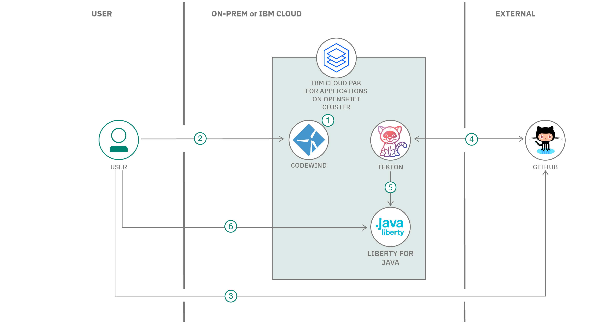

# Short title

Build and Deploy Cloud-Native Java application using IBM Cloud Pak for Applications

# Long title

Develop a Cloud-Native weather application in Java using Codewind and deploy using CI/CD Tekton pipelines

# Author

* [Manoj Jahgirdar](https://developer.ibm.com/profiles/manoj.jahgirdar/)
* [Muralidhar Chavan](https://developer.ibm.com/profiles/muralidhar.chavan/)
* [Shikha Maheshwari](https://developer.ibm.com/profiles/shikha.mah/)

# URLs

### Github repo

* [Build and Deploy Cloud-Native Java application using IBM Cloud Pak for Applications](https://github.com/IBM/build-deploy-manage-cloud-native-application-on-openshift)

# Summary

IBM Cloud Pak for Applications (CP4A) helps you modernize existing applications and develop new cloud-native applications that can quickly deliver value and can be tailored to your specific needs. This can help you to respond to customer needs faster. This code pattern demonstrates the Accelerators for Teams feature of CP4A by developing a cloud-native application and deploying it on OpenShift using CI/CD features.

# Technologies

* [Java](https://developer.ibm.com/technologies/java/): The Java programming language is a high-level, object-oriented language. It is rapidly evolving across several fronts to simplify and accelerate development of modern applications.
* [Continuous Integration](https://developer.ibm.com/technologies/continuous-integration/): Continuous integration (CI) is a software development and DevOps practice of integrating code regularly into one shared repository. Quickly and easily detect errors within your code to keep your team agile and efficient.
* [Continuous Delivery](https://developer.ibm.com/technologies/continuous-delivery/): Automate your software release process with continuous delivery (CD), a practice that allows teams to build, test, and deploy code changes quickly, ensuring your software is always ready for deployment.
* [Tekton](https://developer.ibm.com/articles/introduction-to-tekton-architecture-and-design/)

# Description

Enterprises are moving towards cloud-native development for a host of benefits. However, to realize the benefits of cloud-native development and to deliver faster, enterprises must overcome the challenges of retaining enterprise governance, and the cost of building new skills and transforming end-to-end development practices.

The Accelerator for Teams for cloud-native solutions are designed to speed up the development of cloud-native applications by providing an end-to-end journey from a business problem to a production application. It provides enterprise governance by bringing together Application Stacks, integrated DevOps and a choice of developer tools. Cloud native services is even faster because the Accelerators for Teams automatically generates the development projects, services, and configuration settings that can deploy your application to an OpenShift cluster. All your development teams need to do is code your business logic.

Developer experience for IDEs is provided by Codewind, which is used for creating, building, running, and profiling applications. Tekton pipelines provide consistent, managed, and governed CI/CD processes that react to repository events that occur during code development.

You will develop a simple Java weather application using Codewind and Tekton pipeline for Continous delivery in this code pattern. 

Accelerators for teams not only deliver innovative technology to speed up the design process, it provides Reference Blueprints that are based on Reference Architectures in the  [Cloud Architecture Center](https://www.ibm.com/cloud/architecture/architectures).

When you have completed this code pattern, you will understand how to:

* build a simple Java application using Codewind on Eclipse
* use Tekton pipelines to deploy the Java application on OpenShift using CP4A

At the end, you will run the application with a simple interface which accepts name or latitude/longitude of the location and provides basic weather details of the location using Open Weather API.

# Flow

1. User installs Codewind and adds stack hub provided by IBM Cloud Pak for Applications on IBM Managed OpenShift cluster.
2. User develops an application using a project template available in the added stack hub.
3. User pushes the developed application code to the GitHub repository.
4. User configures Tekton Pipeline and defines GitHub Webhook on IBM Cloud Pak for Applications.
5. Tekton pipeline builds and deploys the application to OpenShift cluster whenever there is code change event in GitHub repository.
6. User accesses the deployed application.

# Instructions

> Find the detailed steps for this pattern in the [readme file](https://github.com/IBM/build-deploy-manage-cloud-native-application-on-openshift/blob/master/README.md). The steps will show you how to:

1. Install Codewind and Appsody
2. Add project templates to Codewind
3. Create a project in Codewind
4. Get API Key from Open Weather
5. Run the application locally
6. Prepare application to be deployed to CP4A
7. Push application code to GitHub repository
8. Create token for your Github
9. Configure and Execute Tekton Pipeline
10. Access the deployed Application

# Components and services

[IBM Cloud Pak for Application](https://developer.ibm.com/series/introduction-ibm-cloud-paks-for-applications/)

[Java](https://developer.ibm.com/technologies/java/)

[Tekton](https://developer.ibm.com/articles/introduction-to-tekton-architecture-and-design/)

# Runtimes

* Java

# Related IBM Developer content

* [Deep dive on IBM Cloud Pak for Application](https://developer.ibm.com/videos/deep-dive-on-ibm-cloud-pak-for-applications/)
* [Introduction to IBM Cloud Pak for Application](https://developer.ibm.com/series/introduction-ibm-cloud-paks-for-applications/)
* [Introduction to Accelerator for Teams](https://developer.ibm.com/articles/introduction-to-accelerators-for-cloud-native-solutions/)
